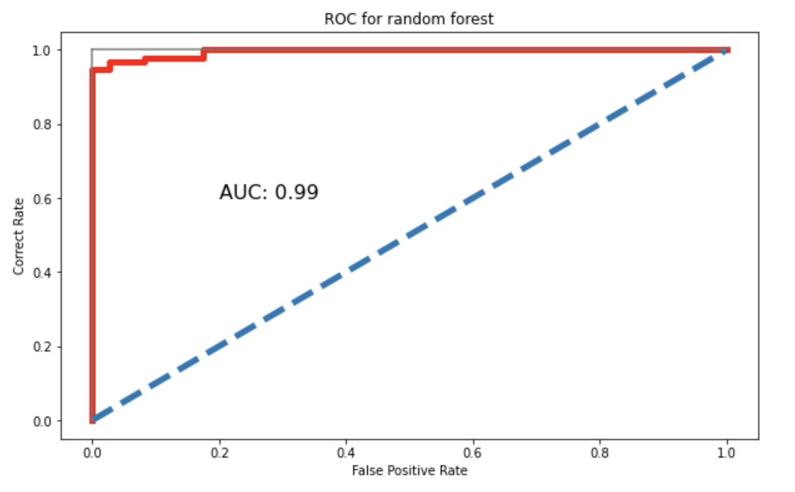
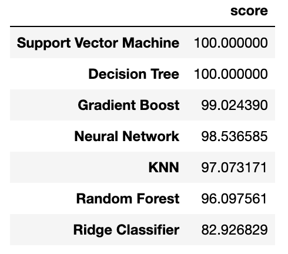

# The prediction of heart disease
> Machine learning prediction of heart disease

## Table of Contents
* [General Info](#general-information)
* [Technologies Used](#technologies-used)
* [Room for Improvement](#room-for-improvement)
* [Acknowledgements](#acknowledgements)
* [Contact](#contact)
<!-- * [License](#license) -->

## General Information
- In this project, various machine learning algorithms were utilized to predict heart diseases using clinically gathered data
- The projects contains, feature engineering, data cleaning, data wrangling, exploratory data analysis, visulization and model development.
- Models include: 1) Linear regression, SVM, decision tree, random forest, gradient boosting, Neural Network, etc..

<!-- If you have screenshots you'd like to share, include them here. -->

## Technologies Used
- Python
- SciKit Learn
- Tensorflow
- Pandas
- Matplotlib

## Room for improvement:
- Will implement XGboost later

## Acknowledgements
- The authors are grateful to Dr. Houlong Zhuang for fruitful discussions.

## Contact
Created by [Miralireza Nabavi Bavil, Van McNulty, Amir Tavakkoli and Julie Larsen](anabavib@asu.edu) - feel free to contact me!
